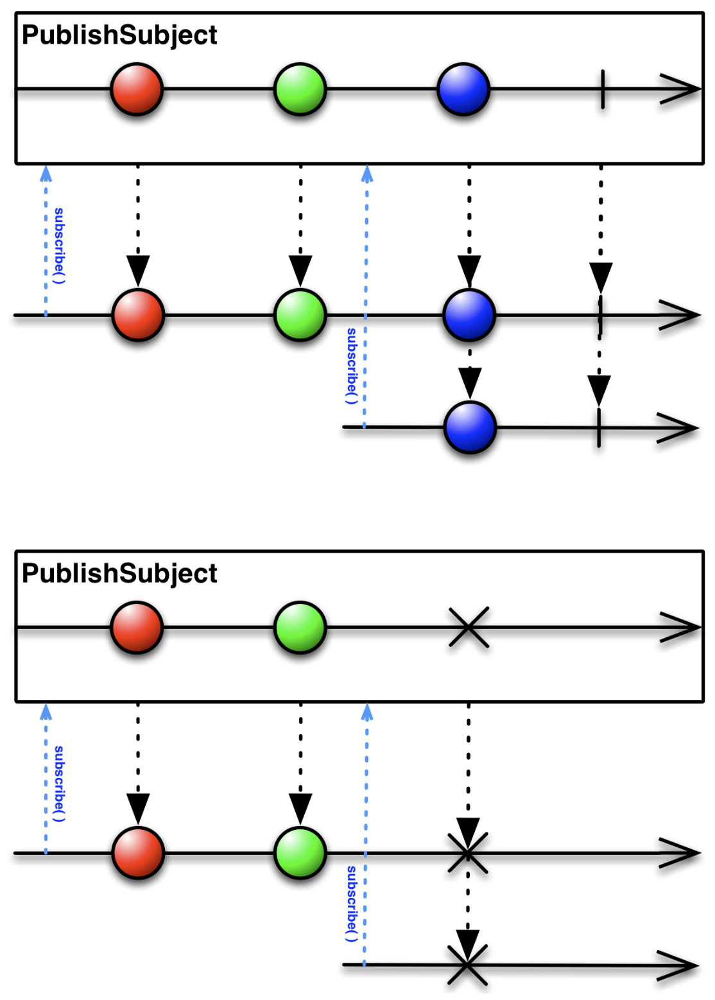
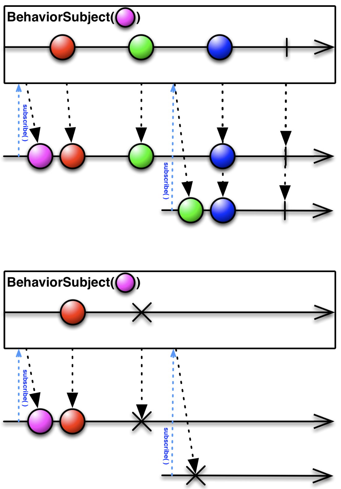
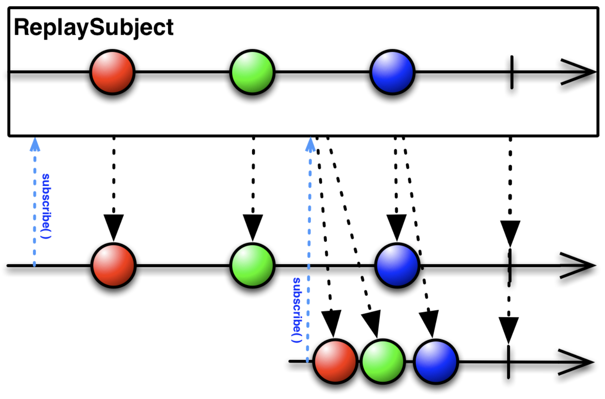
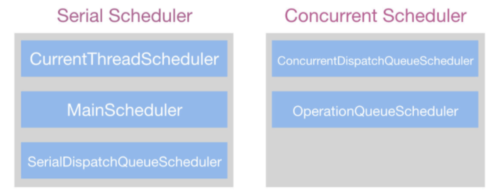
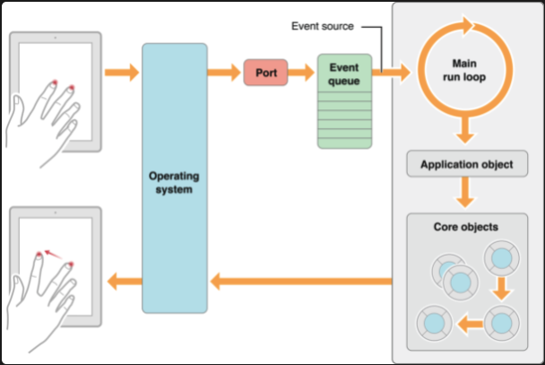
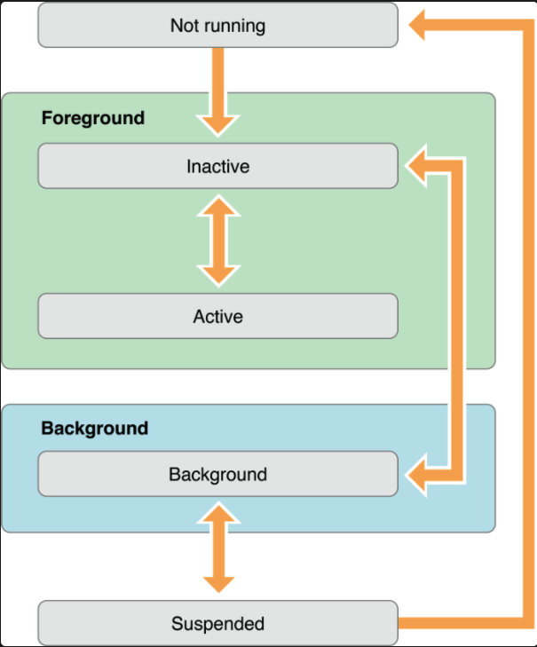
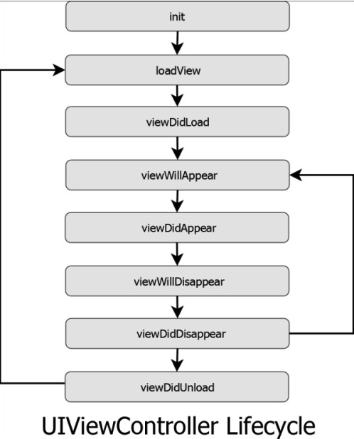
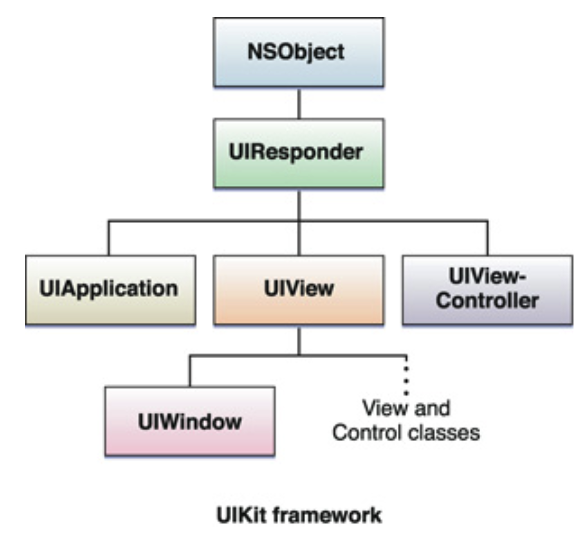
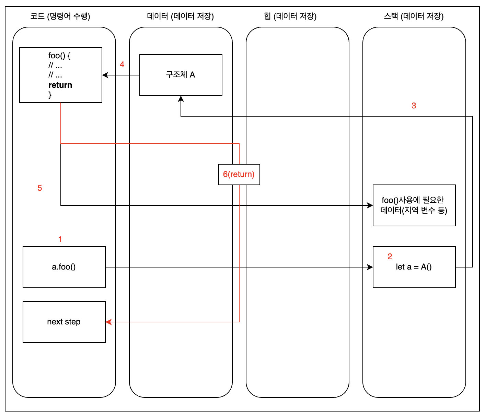

# 면접 예상질문

> 아래는 이직을 위해 여기저기서 짜집기 해본 면접 질문 리스트들이고 스스로 답변을 달아본 글이다.
>
> 나만의 해석으로 적은 내용들도 있으니 **틀릴 수도 있다.**
> ** 오탈자, 내용보충 PR 환영합니다.** 

## RxSwift

### Hot/Cold Observable

[참고 1](https://jcsoohwancho.github.io/2019-10-20-RxSwift%EA%B8%B0%EC%B4%88-Hot-vs-Cold-Observable/), [참고 2](https://reactivex.io/documentation/observable.html), [참고 3](https://nacho.tistory.com/21), [참고 4](https://dongminyoon.tistory.com/58)

공식 Doc 에서의 정의

> When does an Observable begin emitting its sequence of items? It depends on the Observable. A “hot” Observable may begin emitting items as soon as it is created, and so any observer who later subscribes to that Observable may start observing the sequence somewhere in the middle. A “cold” Observable, on the other hand, waits until an observer subscribes to it before it begins to emit items, and so such an observer is guaranteed to see the whole sequence from the beginning.
>
> 해석 : 언제 Observable은 이벤트 발생을 시작하는가? 이는 Observable에 따라 다르다. 
> ‘hot’ Observable은 만들어진 즉시 이벤트를 발생시킬 수 있고, 나중에 오는 구독자는 시퀀스의 중간부터 이벤트를 관찰하게 된다.
> ‘cold’ Observable은 반대로 어떤 Observer에 의해 구독될 때 까지 아이템을 방출하지 않고 기다린다. 그리고 시퀀스 전체를 Observer가 받아볼 수 있음이 보장된다.

* Hot Observable
  * 구독여부에 상관없이 이벤트를 발생 시킴
  * 일단 동작이 시작되면 리소스를 사용하게 된다.
  * 이 동작을 시작하는 시점을 조절할 수 있는 메서드가 제공됨 (`connect()`)
  * 여러 Observer(구독자)가 하나의 Observable을 공유할 수 있다.
  * ConnectableObservable이라고도 부른다.
  * Hot Observable을 Cold Observable과 유사하게 취급할 수 있도록 ReplaySubject 같은 것도 제공
  * Subject, UIEvent, 타이머 등
* Cold Observable
  * 구독과 동시에 무조건 동작한다.
  * 구독 전에는 연산에 필요한 자원을 소모하지 않는다.
  * Observer(구독자)마다 별도의 Observable 인스턴스를 갖게된다.
    * 만약 시퀀스를 만들어 내는 과정이 오래 걸리는 경우 구독이 일어날 때 마다 그 과정을 거쳐야하는 비효율이 야기
    * 이걸 Hot처럼 하나의 Observable을 공유하도록 하려면 `share()`를 사용
  * Http 요청, Single, just, of 등등

### Subject & Relay

[참고 1](https://jinshine.github.io/2019/01/05/RxSwift/3.Subject%EB%9E%80/)

* PublishSubject

  * `.completed`, `.error`이벤트가 발생할 때까지, 즉 종료될 때까지 구독한 이후부터 이벤트를 방출한다.

  

* BehaviorSubject

  * PublishSubject와 유사하지만 초기값을 갖는다.
  * 항상 **직전**의 값부터 구독한다.
  
  
  
* ReplaySubject

  * 생성시 선택한 특정 크기만큼 일시적으로 캐싱하거나 버퍼를 저장해서 최신 요소를 모두 방출한다.
  * 최근 검색어 같은 곳에 사용하면 좋을듯

  

* Subject vs Relay

  * Subject는 RxSwift에 속하고, Relay는 RxCocoa에 속해있다.
  * Relay에는 ReplayRelay가 없다.
  * Subject는 `.completed`, `.error`의 이벤트가 발생하면 subscribe가 종료된다.
  * Relay는 `.completed`, `.error`를 발생하지 않고 Dispose되기 전까지 계속 작동하기 때문에 UIEvent에서 사용하기 적절하다.

### Scheduler

[참고 1](https://velog.io/@hansangjin96/RxSwift-Scheduler-%EC%9E%91%EC%84%B1%EC%A4%91), [참고 2](https://inuplace.tistory.com/1100)

* Cocoa와 RxSwift 비교

  

* observe(on:), subscribe(on:)

  * `observe(on:)`은 시퀀스를 **어느 스케줄러에서 observe할 것인지**를 결정한다. 각각의 Operator(map, filter 등등)를 다른 스케줄러에서 지정하고 싶을 때 사용할 수 있다.
  * `subscribe(on:)`은 시퀀스가 **시작할 스케줄러**를 결정한다. 즉 특정 스케줄러에서 동작의 수행을 보장할 때 한번만 실행하는 것을 권장한다.

* Scheduler의 종류와 자주쓰이는 Scheduler

  

  * MainScheduler

    * MainThread에서 실행되어야 할 작업에서 사용(주로 UI)
    * `instance` vs `aysncInstance` ([참고](https://stackoverflow.com/questions/58332584/rxswift-mainscheduler-instance-vs-mainscheduler-asyncinstance))
      * `instance`
        * main thread에 동기적으로 이벤트를 전달한다.
      * `asyncInstacne`는 이름 그대로 main thread에 비동기적으로 이벤트를 전달한다.
        * 이미 main thread에서 실행되고 있을 때 강제로 비동기 전달을 해야하는 경우가 잘 없다.
        * 종종 같은 파이프라인에서 1번 event가 2번 event를 트리거하는 상황에서 두 event가 동시에 발생하면 경고가 발생한다. 이런 경우 `asyncInstacne`를 사용한다.

  * CurrentThreadScheduler

    * 현재 있는 쓰레드에서 작업이 실행된다.

  * SerialDispatchQueueScheduler

    * 특정한 `dispatch_queue_t`에서 실행되어야 할 작업을 처리한다.
    * 메인 스케줄러는 `SerialDispatchQueueScheduler`의 인스턴스 중 하나 ([RxSwift 코드를 보면 MainScheduler가 이를 상속받고 있다.](https://github.com/ReactiveX/RxSwift/blob/main/RxSwift/Schedulers/MainScheduler.swift))

  * ConcurrentDispatchQueueScheduler

    * 특정한 `dispatch_queue_t`에서 실행되어야 할 작업을 처리한다.
    * Serial Queue에 작업을 보내도 문제가 생기지 않는다.
    * 보통 백그라운드에서 처리해야 할 때 적합하다.

## iOS

### bounds frame의 차이점

* frame
  * 상위 뷰를 기준으로 좌표계를 형성
* bounds
  * view의 위치와 크기를 자신만의 좌표시스템안에서 나타낸다.
  * 화면자체가 이동한다고 생각

### 앱이 시작될 때 main.c에 있는 UIApplicationMain함수에 의해서 생성되는 객체는 무엇인가

* UIApplication 싱글톤 객체가 생성된다.
* 모든 iOS 앱에는 하나의 UIApplication 인스턴스가 있다. 앱이 시작되면 시스템은 UIApplicationMain함수를 호출한다. 이 함수는 싱글톤 UIApplication을 만든다.

### 앱의 실행과정

* main함수가 실행(메인함수가 없기에 @main이 붙은 곳 부터 시작)
* UIApplicationMain함수를 호출
* UIApplication 객체 생성
* nib파일, info.plist 파일을 읽어들여 파일에 기록된 정보를 참고하여 필요한 데이터를 로드
* AppDelegate 객체를 만들고 앱 객체와 연결, 런루프를 만드는 등 실행에 필요한 준비를 한다.
* 실행완료를 앞두고 앱 객체가 AppDelegate에게 didFinishLaunchWithOptions메시지를 보낸다.

### 상태변화에 대해 설명

* not running: 실행되지 않았거나, 시스템에 의해 종료된 상태
* in-active: 실행 중이지만 이벤트를 받고 있지 않은 상태(전화, 메세지 수신)
* active: 어플리케이션이 실질적으로 활동하고 있는 상태
* background: 백그라운드 상태에서 실질적인 동작을 하고있는 상태
* suspended: 백그라운드 상태에서 활동을 멈춘 상태. 메모리에 적재된 상태이지만, 메모리가 부족할 때 OS가 알아서 강제종료 시킨다.

### In-active상태가 무엇이고, 앱이 in-active 상태가 되는 시나리오를 설명

* 앱이 실행중이지만 이벤트를 받지 않는 상태를 의미한다. 보통 이 상태에 잠시 머물렀다가 다른 상태로 변경된다.
  * AppSwitcher로 전환될 때
  * 다른앱의 알림(전화 문자 타이머 등)으로 이벤트를 수신하지 못할 때
* 앱의 실행: not running -> in-active -> acitve
* 백그라운드로 이동: active -> in-active -> background -> (suspended)
* 포그라운드로 이동: background -> in-active -> active

### scene에 대해 설명

* UIKit은 UIWindowScene 객체를 사용하는 앱의 UI의 각 인스턴스를 관리한다.
* Scene에는 UI 하나의 인스턴스를 나타내는 windows와 viewController가 들어있다.
* 각 scene에 해당하는 UIWindowSceneDelegate객체를 갖고 있고, 이 객체는 UIKit과 앱 간의 상호작용을 조정하는데 사용된다.
* Scene들은 같은 메모리와 앱 프로세스를 공간을 공유하면서 서로 동시에 실행된다. 결과적으로 하나의 앱은 여러 scene과 scene delegate객체를 동시에 활성화할 수 있다.

### scene delegate에 대해 설명

* iOS13 부터는 window의 개념이 scene으로 대체되고 하나의 앱에서 여러가지 scene을 가질 수 있다.
* 기존 appDelegate의 역할 중 UI의 상태를 알 수 있는 UILifeCycle에 대한 부분을 SceneDelegate가 하게됐다.

### iOS13에서 AppDelegate가 하는 일

* 앱의 가장 중요한 데이터 구조를 초기화
* 앱의 scene을 환경설정 함
* 앱 밖에서 발생한 알림에 대응
* 특정한 scenes, view, viewcontrollers에 한정되지 않고, 앱 자체를 타겟하는 이벤트에 대응
* APNS(Apple Push Notification service)와 같이 실행 시 요구되는 모든 서비스를 등록

### AppLifecycle에 대해 설명

* https://jinshine.github.io/2018/05/28/iOS/%EC%95%B1%EC%9D%98%20%EC%83%9D%EB%AA%85%EC%A3%BC%EA%B8%B0(App%20Life%20Cycle)%EC%99%80%20%EC%95%B1%EC%9D%98%20%EA%B5%AC%EC%A1%B0(App%20Structure)/

* https://hcn1519.github.io/articles/2017-09/ios_app_lifeCycle

* 앱을 실행하면 일어나는 일

  1. @main이 실행
  2. UIApplicationMain을 이용해 싱글톤 UIApplication을 생성
  3. nib, info.plist파일을 읽어 필요한 데이터를 로드
  4. AppDelegate를 만들고 앱객체와 연결, 런루프를 만드는 등 실행한 필요한 작업을 수행
  5. 실행완료를 앞두고 AppDelegate의 didFinishLaunchWithOpations 메서드 호출 

* Main Run loop (출처: https://developer.apple.com/documentation/uikit)
  

  1. 유저가 이벤트를 발생
  2. 시스템을 통해 이벤트가 생성
  3. UIKit 프레임워크를 통해 생성된 port로 해당 이벤트가 앱으로 전달
  4. 이벤트는 앱 내부적으로 Queue의 형태로 정리되고 Main Run Loop에 하나씩 매핑
  5. UIApplication 객체는 이때 가장 먼저 이벤트를 받는 객체로 어떤 것이 실행되어야 하는지 결정한다.

* 앱의 상태변화(출처: https://developer.apple.com/documentation/uikit)

  

### ViewController Lifecycle에 대해 설명

* https://getbingsoo.tistory.com/m/21
* https://tono18.tistory.com/11
* ViewConrollerLifecyle
  
  * loadView
    * 화면에 띄어줄 view를 만드는 메서드로 view를 만들고 메모리에 올림
    * 직접 호출 금지
      * https://leehonghwa.github.io/blog/loadView/
  * viewDidLoad
    * 뷰의 컨트롤러가 메모리에 로드된 후에 호출되며 시스템에 의해 자동으로 호출이 된다.
    * 생에 딱한번 호출
      * 1번 뷰에서 2번뷰를 띄우고 다시 1번뷰를 띄었을 때는 viewDidLoad호출하지 않는다.
  * viewWillAppear
    * 뷰가 화면에 나타나기 직전에 호출이 된다.
  * viewDidAppear
    * view가 데이터와 함께 완전히 화면에 나타난 후 호출되는 메서드
  * viewWillDisappear
    * 다음 view controller 화면이 전환하기 전이나 view controller가 사라지기 직전에 호출되는 메서드
  * viewDidDisappear
    * view controller들이 화면에서 사라지고 나서 호출되는 메서드
    * 화면이 사라지고 나서 종료해야하는 작업들을 여기서 할 수 있음.

### UIResponder에 대해 설명, responder chain이란

* https://zeddios.tistory.com/538

* https://jinsangjin.tistory.com/115

* 모든 ViewConroller,UIView,UIApplication 객체의 상위 클래스

  

* 기본 데이터의 변경에 대한 응답으로 뷰의 콘텐츠를 업데이트

* 뷰와 사용자 상호 작용에 응답

* 뷰 크기 조정 및 전체 인터페이스의 레이아웃 관리

* 앱에서 다른 뷰 컨트롤러를 포함한 다른 객체와 조정

* 이벤트가 발생하면 UIKit은 이를 처리할 수 있도록 앱의 Responder 객체에 전달

* **간단히 말해 이벤트에 반응하고 이를 핸들링할 수 있는 객체**

* Responder chain

  * responder객체는 이벤트를 직접 처리하지 않고 이벤트를 다른 객체에게 넘길 수 있다.
  * responder chain에 따라 **"처리되지 않은 이벤트는"** 다른 responder 객체로 넘겨진다.
  * Responder chain을 관리하는 메서드들이 존재
  * 화면 진입 시 UITextField를 becomFirstResponder()로 설정하게 되면 키패드가 올라온다.
  * responder chain의 순서는 bottom up 방식
    * 초기 view(이벤트를 최초로 받은 view)먼저 이벤트를 처리하려고 시도 
    * 이벤트를 처리할 수 없는 경우 초기view의 super view 에 이벤트를 전달
    * 다시 이벤트 처리할 수 없으면 super view... 이런식으로 쭉 올라가서
    * view controller -> window -> application객체에서 처리 불가할 경우 이벤트 삭제

### NotificationCenter동작방식과 활용 방안

* 등록된 모든 observer에게 정보를 전달하는 메커니즘
  1. observer 등록
  2. 작업 발생
  3. observer들에게 정보 전달

### UIKit클래스들을 다룰 때 꼭 처리해야하는 앱 쓰레드 이름은 무엇인가

* UI는 main thread에서만 처리해야한다.
* 이유는 UIKit이 thread-safe하지 않기 때문. 성능면에서 효율적이지 않기 때문에 main thread 에서만 작동하게 하고 모든 처리를 serial하게 동작하도록 한다.
* 모든 view의 변경사항은 즉시 변경되는 것이 아니라 현재 run loop의 끝에서 다시 그려진다. 만약 모두 main thread에서 작업하지 않는다면 view의 layout이 제대로 동작한다고 보장할 수 없음.

### DispatchQueue.main.sync에 대해 설명

* https://ios-development.tistory.com/598
* DispatchQueue.main.sync를 호출하게 되면 끊임없이 앱의 이벤트 처리를 하고 있던 main thread가 sync 호출에 의해 멈추게 되고 deadlock 발생

### UIView에서 Layer객체는 무엇이고 어떤 역할을 담당하는가

* https://getbingsoo.tistory.com/m/21
* https://velog.io/@yongchul/iOSCALayer%EC%9D%98-%EA%B8%B0%EB%B3%B8-%EA%B0%9C%EB%85%90
* UIView는 사실 CALayer의 wrapper일 뿐이다. UIView는 많은 것을 처리하지만 사실 어떤 그림이나 애니메이션들은 직접 제어하지 않고, 내가 view에 어떤 일을 시키면 이 안의 layer객체에서 이 일을 직접 수행한다.
* 실제로 view의 대부분의 속성은 layer의 속성에 접근하는 역할을 수행한다. view가 layer의 delegate(대리자)이기 때문

### UIWindow 객체의 역할은 무엇인가

* https://jwonylee.github.io/iOSInterviewquestions/UIWindow
* https://zeddios.tistory.com/283
* UIWindow는 사용자 인터페이스에 배경을 제공하고, 중요한 이벤트 처리행동을 제공하는 객체
* iOS앱은 모든 View들의 컨테이너 역할을 하는 UIWindow인스턴스를 하나 가지는데,(app delegate에 정의되어있음) UIWindow는 UIView의 하위클래스 이므로 Window는 그 자체가 View라고 할 수 있다.
* Window는 눈에 보이는 내용은 없지만, 앱의 View에 기본 컨테이너를 제공
  * window는 액자 이고 view는 그 액자에 끼워넣는 사진이라 생각하면 된다.
* 스크린에 나타나는 모든 view는 window로 묶여있으며, 각 window는 앱의 다른 view와 독립적이다.

### Glyph란

### UITextView의 구성요소

### TextKit2

## Swift

### 값타입과 참조타입

* 값타입
  * 대입연산이 일어날 때 값을 복사한 후 사용
  * 보통은 짧게 쓰고 해제
  * stack 메모리 영역에 적재된다.
  * 참조타입보다 비교적 빠르다.
  
* 참조타입
  * 대입연산이 일어날 때 레퍼런스(주소값)을 복사한 후 사용
  * 보통 오랫동안 사용되는 객체를 사용한다.
  * heap 영역에 적재된다.
  * 값타입보다 비교적 느리다.
  
* 값타입이 참조타입 메모리 접근 방식 (클래스와 구조체의 차이)
  * 값타입 (struct)
    * 인스턴스가 보통은 stack영역에 할당(정확히는 [Swift의 모든 값유형은 선언된 메모리 위치에 할당된다.](https://stackoverflow.com/questions/54336089/can-a-swift-struct-be-allocated-on-the-heap-when-its-a-stored-property)) 
    
    * struct의 뼈대(틀)는 data영역에 저장되고, 인스턴스는 stack(앞서 말했듯이 정확히는 선언된 메모리 위치)영역에 위치한다.
    
    * stack영역에 있는 instance는 스택 프레임 생명주기를 따르게 된다.
    
    * instance가 stack에 있기 때문에 일반적으로 내부 변수(저장 프로퍼티)는 바꿀 수 없다.(mutable을 쓰면 가능하긴 함)
    
    * 값타입(구조체) 메서드 수행 시 어떤 일들이 일어나는가 (`let a = A()`라는 구조체 인스턴스를 stack에 선언, `a.foo()`실행 시)
      
      
      
      1. 코드영역에서 `a.foo()` 명령어 수행
      2. 스택영역에서 a의 instance를 찾고, a의 뼈대가 어디있는지 찾는다.
      3. 데이터영역에서 `a`의 뼈대 즉, struct A를 찾는다.
      4. 구조체의 `foo()`가 코드영역의 어디에 위치하는지 확인 후 분기(메서드 호출)
      5. stack frame에 foo라는 메서드가 쌓이게 되고 메서드 명령어 수행
      6. return. (PC register가 코드 영역의 `a.foo()`호출했던 명령어의 다음명령어를 가르킨다.)
    
  * 참조타입 (class)
  
    * 인스턴스가 heap영역에 할당
  
    * class의 뼈대(틀)은 data영역에 저장되고 객체는 heap 영역에 생성된다.
  
    * heap할당되기 때문에 stack frame에서 내부 변수(저장 프로퍼티)접근 시 heap을 통해야 가능하므로 프로퍼티가 mutable하다.
  
    * 참조타입(class) 메서드 수행 시 어떤 일들이 일어나는가 (`let a = A()`라는 class 인스턴스를 생성, `a.foo()`실행 시)
  
      
  
      1. 코드영역에서 `a.foo()` 명령어 수행
      2. 스택영역에서 a의 instance가 어디있는지 찾는다.
      3. heap영역에서 `a`의 instance를 찾고, a의 뼈대가 어디있는지 찾는다.
      4. 데이터영역에서 a의 뼈대 즉, class A를 찾는다.
      5. class의 `foo()`가 코드영역의 어디에 위치(어느 테이블에 위치)하는지 확인 후 분기(메서드 호출)
      6. stack frame에 foo라는 메서드가 쌓이게 되고 메서드 명령어 수행
      7. return. (PC register가 코드 영역의 `a.foo()`호출했던 명령어의 다음명령어를 가르킨다.)

### dynamic(table) dispatch vs static(direct) dispatch (값타입이 참조타입보다 빠른 이유)

[참고 1](https://sihyungyou.github.io/iOS-method-dispatch/), [참고 2](https://jcsoohwancho.github.io/2019-11-01-Swift%EC%9D%98-Dispatch-%EA%B7%9C%EC%B9%99/)

### protocol과 class 의 메모리 변화

* protocol을 채택한 class의 instance의 메모리 구조를 살펴보면
* heap영역에 class의 프로퍼티 영역, 메서드(virtual table)영역, extension 영역, 프로토콜 영역이 존재한다.
* 여기서 메서드 영역은 virtual table로 구성이 되어 있고, dynamic dispatcher형태이다.
  * virtual table에는 class가 갖고 있는 메서드, protocol를 채택해 구현한 메서드, protocol을 채택해 딸려오는 default 메서드의 코드영역 주소를 갖고 있다.
* 프로토콜 영역은 witness table로 구성이 되어 있고, 마찬가지로 dynamic dispatcher이다.
  * witness table에는 class가 protocol을 채택해 구현 메서드의 코드영역 주소를 갖고 있다.
* 한가지 특이한 점은 witness table이 가르키고 있는 메서드 코드 영역 주소는 virtual table에 있는 같은 메서드에 대해서 동일하다.

### 상속과 class 메모리

### Array와 Dictionary는 값타입(구조체)이기 때문에 메모리에 값이 복사되는데 array가 엄청 클 때는 항상 복사(읽기/쓰기)가 일어나는데 이 상황에 대해 설명

[참고](https://nsios.tistory.com/56)

* 사실 Collection 타입의 경우 Copy on Wrtie가 일어난다.
* Collection 타입의 요소를 새로운 변수에 할당할 때 마다 복사가 일어난다면 비효율적이다.
* 그래서 배열 a를 생성하고 배열 b에 a를 할당한다면 a의 값이 복사가 되는 것이 아닌 a가 갖고 있는 배열의 주소를 갖고 있다.
* 이때 b의 값을 변경한다면 그때 새로운 배열을 메모리에 생성한 후 b가 해당 배열의 주소를 갖게 된다.

### Optional이란

* 변수에 값이 있는지 없는지를 확인하기 위한 타입이다.
* enum으로 선언되어 있으며 내부를 보면 switch-case로 되어 있다.
* case는 some과 none이 있으며, some은 값이 들어있다는 뜻으로 그 값을 return한다. none은 값이 비어 있다는 상태를 의미함.

* none에서는 값이 비어있다는 의미인 nil을 return 한다.

### strong delegate

[참고1](https://fomaios.tistory.com/entry/iOS-%EB%A9%B4%EC%A0%91%EC%A7%88%EB%AC%B8-Delegate%EB%8A%94-retain%EC%9D%B4-%EB%90%A0%EA%B9%8C), [참고 2](https://velog.io/@aurora_97/TIL-Delegate%EC%99%80-Weak)

### Optional closure에 @escaping을 안붙히는 이유

[참고](https://stackoverflow.com/questions/39618803/swift-optional-escaping-closure-parameter)

* `(() -> Void)?`타입은 이렇게 표현이 가능하다. `Optional<()->Void>` 즉, closure가 아니다.
* `@escaping` 키워드는 closure앞에만 붙을 수 있다.

### method swizzling이란

* https://zeddios.tistory.com/554
* 런타임에 어떤 메서드를 내가 원하는 메서드로 바꾸는 것
* 다이나믹 디스패처를 지원하는 언어에서 사용되는 기법

### 탈출클로저란

* 메서드 내부에서 parameter로 closure로 받는 경우가 있다. 이 때 메서드가 종료가 된 이후에도 closure가 남아 있어서 호출되야 하는 시점에 적절히 호출되어야 하는 경우가 있는데,(비동기 콜백 후 호출 등) @escaping 키워드를 이용해 메서드가 종료된 이후에도 수행할 수 있도록 한다. 
* 추가로 @escaping 키워드없이 받는 클로저는 모두 non-escaping 클로저이고, 다음과 같은 특징을 갖는다.
  * 함수 내부에서 직접 실행하기 위해서만 사용한다. 
  * 따라서 파라미터로 받은 클로저는 변수나 상수에 대입할 수 없고, 중첩 함수 내부에서 클로저를 사용할 경우, 중첩함수를 리턴할 수 없다.
  * 함수의 실행 흐름을 탈출하지 않아, 실행을 하고자 한다면 함수가 종료되기전에 실행 되어야 한다.
  * 실제로 non-escaping은 메모리의 효율성을 위해 따로 heap영역에 closure를 저장하지 않고 바로 코드영역을 호출하는 static dispatcher 형태로 되어있다.

### 동시성과 관련된 문제 및 해결방법

* https://sujinnaljin.medium.com/ios-%EC%B0%A8%EA%B7%BC%EC%B0%A8%EA%B7%BC-%EC%8B%9C%EC%9E%91%ED%95%98%EB%8A%94-gcd-14-4aefd4ba1eb7
* 경쟁상황
  * 자원 a에 대해 여러개의 task 가 동시에 접근해서 자원 a를 변경하려고 할 때 자원 a에 대해 무결성을 보장할 수 없다.
  * 해결방법
    * 비동기 task에서 해당 자원 a에 접근을 할 때 SerialQueue에 넣어 sync로 접근하도록 한다.
    * 또다른 방법으로는 DispatchQueue에서 지원해주는 barrier를 이용해 자원 a에 대해 write할 때 barrier를 적용해 다른 task가 접근하지 못하도록 막을 수 있다.
* 교착상태
  * 상호베타적인 task1, 2에 대해 task1에서 a자원을 사용하고 있고, b자원을 사용해야 한다. 반대로 task2에서 b자원을 사용하고 있고, a자원을 필요로 한다. task1에서 b자원을 활용한 프로세스가 완료되지 않았기 때문에 task1은 완료될 수 없다. 마찬가지로 task2에서 a자원을 활용한 프로세스가 완료되지 않았기 때문에 task2도 완료될 수 없다. 이러한 상황을 교착상태라고 한다.
  * 해결방법
    * serial queue 를 이용해 해결하면 된다. serial queue는 한번에 하나의 task를 처리하기 때문에 task2 가 b를 lock()거는 상황을 방지하기 전에 task1를 수행하도록 한다.
* lazy var이슈
  * lazy var로 선언된 프로퍼티a에 대해 여러 task가 동시에 접근할 경우 여러개의 a가 생성되는 문제
  * 해결방법
    * lazy 변수는 접근할 때 메모리에 생성되므로 여러 task가 호출되기 전 먼저 접근을 해 메모리에 생성한다.
    * 변수 a의 값을 return해주는 연산 프로퍼티 b를 만든다. b의 get 블럭에는 serialQueue.sync로 a에 접근해 리턴한다.
    * DispatchQueue barrier를 이용해 변수a에 접근할 때 다른 task가 진입하지 못하도록 한다.
* 우선순위뒤바뀜
  * 우선순위가 가장 높은 순으로 task3, task2, task1과 공유자원 a가 있을 때 task1과 task3는 공유 자원을 사용한다. 
    첫번째로 task1이 먼저 큐에 들어와 작업을 수행한다.
    task1에서 공유자원 a에 락을 거는 순간 (task1이 종료되기 전임) 
    우선순위가 더 높은 task2가 큐에 들어와 작업을 수행한다.
    task2의 작업이 완료되기 전에 우선순위가 가장 높은 task3가 큐에 들어와 작업을 수행한다.
    이때 task3는 공유자원 a를 사용해야하는데 락이 걸려있기 때문에(task1에서 a에 락을 걸어버린채로 일시정지) 작업을 완료하지 못하고 일시정지 된다.
    작업의 우선순위는 그 다음 우선순위를 갖고있는 task2에게로 넘어온다. 
    task2의 작업이 완료되고 a자원의 락을 풀어야 하므로 task1이 수행되고 마지막으로 task3가 수행된다.
    task2 -> task1 -> task3
    실제 우선순위가 가장 높은 작업은 task3인데 마지막에 완료되는 모습.
  * 해결방법
    * 실제로는 GCD에서 알아서 조정해준다. task1이 a에 락을 걸게되면 a자원을 풀어줘야 하기때문에 task1이 가장 먼저 완료되고 그 다음은 우선순위대로 task3, task2 순이다.
      task1 -> task3 -> task2
    * 실제 코딩을할때는 개발자는 (안전하게)공유된 자원 접근시 동일한 QoS 사용하는 것을 권장한다

* 한 화면에 썸네일이 100개정도 있다고 가정했을 대 100개 각각 통신을 하게 된다면, GCD는 이것을 버텨낼까? GCD는 몇개의 스레드까지 커버할까? 해결방법은?
  * https://stackoverflow.com/questions/7213845/number-of-threads-created-by-gcd
  * GCD의 최대 thread pool은 66개이다.
  * 해결방법
    * ?

### serialQueue, concurrentQueue, sync, async, main, global에 대해 설명

* serialQueue
  * 직렬도 되어있는 Queue. 한번에 하나의 task만을 처리한다.
  * GCD의 main, custom Queue(default)가 여기에 해당됨.
* concurrentQueue
  * 병렬로 되어있는 Queue. 한번에 여러개의 task를 처리한다.
  * GCD의 global Queue, cusom Queue 가 여기에 해당됨.
* sync
  * 동기적(순차적)으로 수행
* async
  * 비동기적으로 수행. 이전 task의 완료 여부와는 상관없이 여력이 된다면 수행.
* main
  * 대표적인 serial queue.
* global
  * 대표적인 concurrent queue. 여러 QoS가 존재하며, 각 QoS 레벨에 따라서 우선순위가 달라짐

### ARC란 무엇인지 설명

* 스위프트에서는 객체를 참조할 때마다 객체의 RC가 증가하게 되고, 참조를 잃게 되면 RC가 감소하게 되는데 이 RC의 Counting을 자동으로 해주는 것이 ARC

### 강한 순환참조는 어떤 경우에 발생하는지 설명

* 서로 다른 객체 A, B에 대해 객체에 속해 있는 프로퍼티 a, b를 서로 참조하고 있을 때 객체를 초기화한 변수를 해제해 RC를 감소시켜도 프로퍼티 a, b는 서로를 참조하고 있기 때문에 RC는 0가 되지 않는다. 따라서 메모리에서 해제되지 않고 이미 초기화변수를 메모리에서 해제했기 때문에 a, b에 대해 접근할 수도 없다. 메모리 누수가 발생

### 캡처리스트가 무엇이고 왜 사용하는지

* https://babbab2.tistory.com/50
* https://babbab2.tistory.com/83
* 클로저 캡처
  * 클로저는 값을 캡처할 때 value/reference 타입에 관계없이 reference를 capture한다.
  * reference 타입의 경우에는 강한 순환참조가 일어날 수 도 있고
  * value 타입의 경우에는 클로저 내부에서 해당 value를 수정하게 되면 원본 value의 값이 변경될 수 있다.
  * 이러한 문제들을 해결하기 위해 클로저의 캡처리스트를 사용한다.
* 캡처리스트
  * 값타입의 경우 현재 value의 상태를 "캡처"(복사)해서 가져온다. 따라서 원본 value의 값에 영향이 없음.
  * 참조타입의 경우에는 캡처리스트를 이용해 캡처한다고 해도 항상 주소값을 가져온다. 그렇다면 참조타입일 경우에는 언제 쓰이는가?
    * [weak self]를 이용해 현재 객체의 RC를 증가시키지 않게해서 강한 순환참조를 예방할 때 쓰인다.

## 공통주제

### MVVM

### Clean Architecture

### OOP

## RIBs/모듈화

### 왜 약한 의존성을 유지해야하는가

### RIBs의 장점과 사용이유

### RIBs의 단점과 주의 사항

## TCA

## Modern Concurrency (async/await)

## Combine

## 알고리즘(라이브 코딩테스트 대비)

### 탐색

### 정렬
